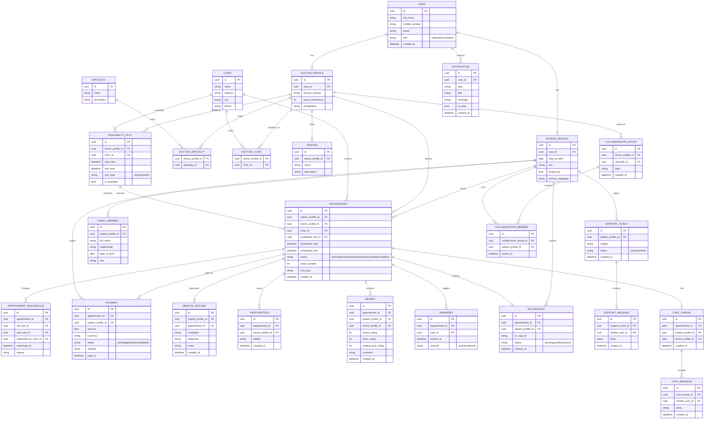

# Schedula ER Diagram

```mermaid
erDiagram
    USER {
        uuid id PK
        string full_name
        string mobile_number
        string email
        string role "patient|doctor|admin"
        datetime created_at
    }

    PATIENT_PROFILE {
        uuid id PK
        uuid user_id FK
        date date_of_birth
        string sex
        float weight_kg
        string primary_language
    }

    DOCTOR_PROFILE {
        uuid id PK
        uuid user_id FK
        string license_number
        int years_experience
        string designation
    }

    SPECIALTY {
        uuid id PK
        string name
        string description
    }

    DOCTOR_SPECIALTY {
        uuid doctor_profile_id FK
        uuid specialty_id FK
    }

    CLINIC {
        uuid id PK
        string name
        string address
        string city
        string phone
    }

    DOCTOR_CLINIC {
        uuid doctor_profile_id FK
        uuid clinic_id FK
    }

    SERVICE {
        uuid id PK
        uuid doctor_profile_id FK
        string name
        string description
    }

    AVAILABILITY_SLOT {
        uuid id PK
        uuid doctor_profile_id FK
        uuid clinic_id FK
        datetime start_time
        datetime end_time
        string visit_type "regular|online"
        bool is_available
    }

    APPOINTMENT {
        uuid id PK
        uuid patient_profile_id FK
        uuid doctor_profile_id FK
        uuid clinic_id FK
        uuid availability_slot_id FK
        datetime scheduled_start
        datetime scheduled_end
        string status "planned|confirmed|rescheduled|cancelled|completed"
        int token_number
        string visit_type
        datetime created_at
    }

    APPOINTMENT_RESCHEDULE {
        uuid id PK
        uuid appointment_id FK
        uuid old_slot_id FK
        uuid new_slot_id FK
        uuid requested_by_user_id FK
        datetime requested_at
        string reason
    }

    PAYMENT {
        uuid id PK
        uuid appointment_id FK
        uuid patient_profile_id FK
        float amount
        string currency
        string status "pending|paid|refunded|failed"
        string method
        datetime paid_at
    }

    MEDICAL_RECORD {
        uuid id PK
        uuid patient_profile_id FK
        uuid appointment_id FK
        string complaint
        string diagnosis
        string notes
        datetime created_at
    }

    PRESCRIPTION {
        uuid id PK
        uuid appointment_id FK
        uuid doctor_profile_id FK
        string details
        datetime created_at
    }

    REVIEW {
        uuid id PK
        uuid appointment_id FK
        uuid patient_profile_id FK
        uuid doctor_profile_id FK
        int doctor_rating
        int clinic_rating
        int waiting_time_rating
        string comment
        datetime created_at
    }

    NOTIFICATION {
        uuid id PK
        uuid user_id FK
        string type
        string title
        string message
        bool is_read
        datetime created_at
    }

    REMINDER {
        uuid id PK
        uuid appointment_id FK
        uuid user_id FK
        datetime remind_at
        string channel "push|sms|email"
    }

    IVR_REQUEST {
        uuid id PK
        uuid appointment_id FK
        uuid patient_profile_id FK
        string ivr_app_id
        string status "pending|verified|expired"
        datetime created_at
    }

    FAMILY_MEMBER {
        uuid id PK
        uuid patient_profile_id FK
        string full_name
        string relationship
        date date_of_birth
        string sex
    }

    SUPPORT_TICKET {
        uuid id PK
        uuid patient_profile_id FK
        string subject
        string status "open|resolved"
        datetime created_at
    }

    SUPPORT_MESSAGE {
        uuid id PK
        uuid support_ticket_id FK
        uuid sender_user_id FK
        string body
        datetime created_at
    }

    CHAT_THREAD {
        uuid id PK
        uuid appointment_id FK
        uuid patient_profile_id FK
        uuid doctor_profile_id FK
        datetime created_at
    }

    CHAT_MESSAGE {
        uuid id PK
        uuid chat_thread_id FK
        uuid sender_user_id FK
        string body
        datetime created_at
    }

    COLLABORATION_GROUP {
        uuid id PK
        uuid doctor_profile_id FK
        uuid specialty_id FK
        string topic
        datetime created_at
    }

    COLLABORATION_MEMBER {
        uuid id PK
        uuid collaboration_group_id FK
        uuid patient_profile_id FK
        datetime joined_at
    }

    USER ||--o| PATIENT_PROFILE : has
    USER ||--o| DOCTOR_PROFILE : has

    DOCTOR_PROFILE ||--o{ DOCTOR_SPECIALTY : maps
    SPECIALTY ||--o{ DOCTOR_SPECIALTY : maps

    DOCTOR_PROFILE ||--o{ DOCTOR_CLINIC : practices_at
    CLINIC ||--o{ DOCTOR_CLINIC : hosts

    DOCTOR_PROFILE ||--o{ SERVICE : offers

    DOCTOR_PROFILE ||--o{ AVAILABILITY_SLOT : publishes
    CLINIC ||--o{ AVAILABILITY_SLOT : schedules

    PATIENT_PROFILE ||--o{ APPOINTMENT : books
    DOCTOR_PROFILE ||--o{ APPOINTMENT : attends
    CLINIC ||--o{ APPOINTMENT : location
    AVAILABILITY_SLOT ||--o{ APPOINTMENT : reserved

    APPOINTMENT ||--o{ APPOINTMENT_RESCHEDULE : changes

    APPOINTMENT ||--o{ PAYMENT : paid_by
    PATIENT_PROFILE ||--o{ PAYMENT : makes

    APPOINTMENT ||--o| MEDICAL_RECORD : generates
    APPOINTMENT ||--o{ PRESCRIPTION : issues

    APPOINTMENT ||--o{ REVIEW : receives

    USER ||--o{ NOTIFICATION : receives
    APPOINTMENT ||--o{ REMINDER : triggers

    PATIENT_PROFILE ||--o{ IVR_REQUEST : initiates
    APPOINTMENT ||--o| IVR_REQUEST : confirms

    PATIENT_PROFILE ||--o{ FAMILY_MEMBER : manages

    PATIENT_PROFILE ||--o{ SUPPORT_TICKET : opens
    SUPPORT_TICKET ||--o{ SUPPORT_MESSAGE : contains

    APPOINTMENT ||--o| CHAT_THREAD : has
    CHAT_THREAD ||--o{ CHAT_MESSAGE : includes

    DOCTOR_PROFILE ||--o{ COLLABORATION_GROUP : sponsors
    COLLABORATION_GROUP ||--o{ COLLABORATION_MEMBER : includes
    PATIENT_PROFILE ||--o{ COLLABORATION_MEMBER : joins
```
